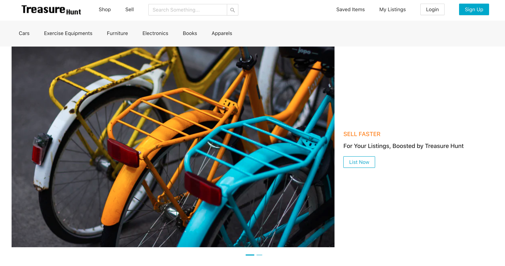
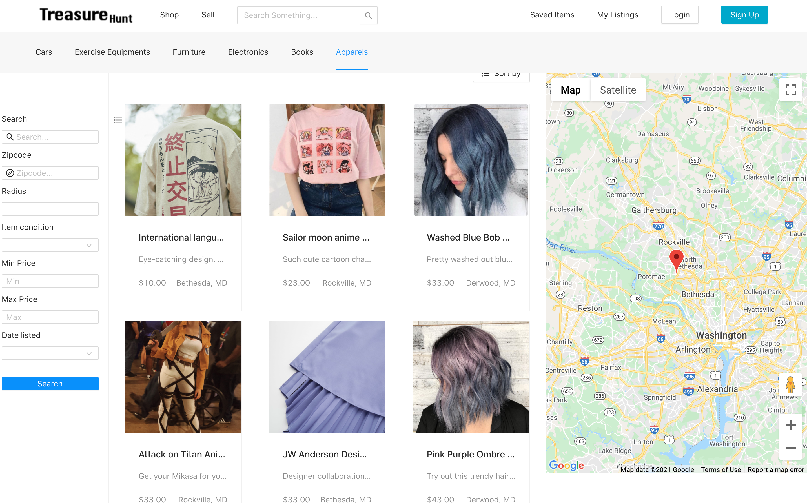

# Treasure Hunt

Frontend repository for Treasure Hunt. For the backend repository, please refer to [this](https://github.com/ruichen199801/treasure-hunt-backend) link.

## Description

 

Treasure Hunt is a marketplace to buy and sell used goods. Users can browse listings, search nearby listings, and list their items for sale after creating an account and logging in. Check out the [video tour](https://youtu.be/SLAWR725oac), or visit the [deployed website](https://treasure-hunt-314706.uc.r.appspot.com).

## Tech Stack

- Frontend: React, Ant Design
- Backend: Java Servlets, MySQL, Elasticsearch, JWT
- Infrastructure: CloudSQL, GCS, Elasticsearch on GCP VM
- Deployment: Frontend and backend are deployed separately on GAE

## Main Features

 

Users can browse listings in different categories such as cars, furniture, electronics, books, apparel, and more. Additionally, they can browse nearby listings on a map, making it easy to find local listings, and search listings by keyword, category, distance, date, and price.

As a buyer, users can communicate with the seller via validated student email for items they are interested in. They can also save listings to revisit them later.

As a seller, users can specify the details of the item for sale and upload up to 10 pictures in any format. They can manage their listings, including editing and deleting them.

## Contributors

- Team Lead: Licheng, Linda
- Tech Lead: Licheng, Niu
- Frontend: Ziyu, Linda, Lihua, Vienna
- Backend: Fangqing, Ruichen, Yixin, Yitien, Ivan
- UI/UX: Ziyu, Yixin
