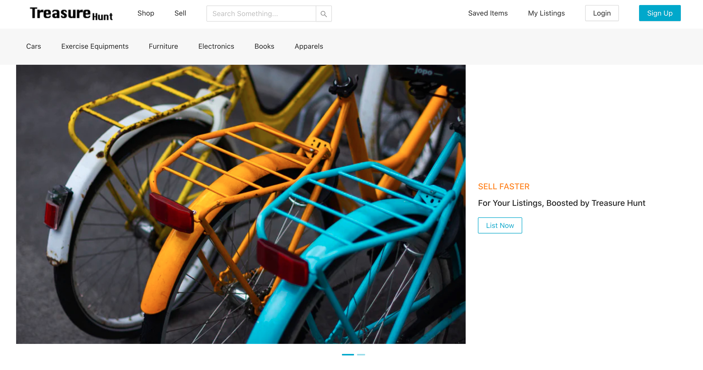
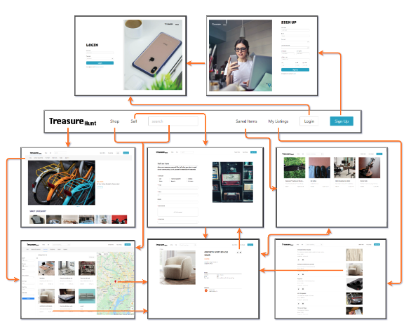
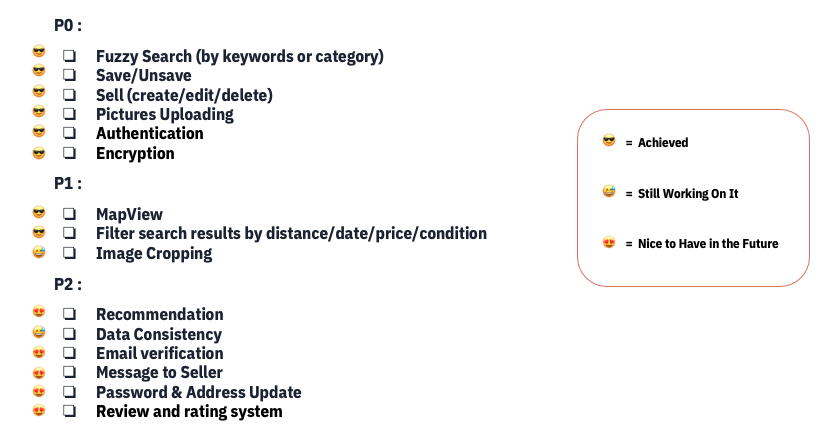
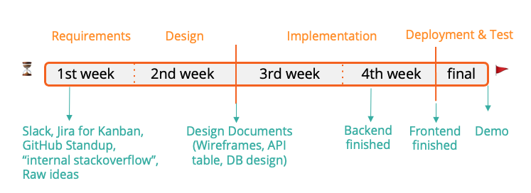

## Treasure Hunt

### 1. Description

Treasure Hunt is a second-hand market website for users to buy and sell used goods for cheap prices. Users can create their account and log in to browse listings from multiple categories, search nearby listings, or list their items for sale. Check the [link](https://www.youtube.com/watch?v=SLAWR725oac&list=PLFPOFjKi8duLZ9TLNnaI-q5kerxkAtLOr&index=3&t=12s) here for a 3-minute video tour.

---

### 2. Main Features

#### 2.1 Motivation

In order to help X city’s students effectively buy and sell used goods online and reduce fraud risk, we developed an website so that users can:

* **Browse**
    - Browse listings in different categories such as cars, furniture, electronics, books, apparels, etc.
    - Browse nearby listings on a map
* **Save**
    - Save/unsave listings 
* **Search**
    - Search listings by keyword, category, distance, date, price, condition, etc.
* **Buy** 
    - Communicate with the seller via validated student email 
* **Sell**
    - Specify the details of the item for sale, and upload up to 10 pictures in any format
    - Manage their listings, including edit and delete

#### 2.2 Critical user journey

#### 2.3 Requirement list

---

### 3. Technical Structures

#### 3.1 Frontend

**Tech Stack:** React with Ant Design

* **UX Highlights**
    - Loading icon: responsive data fetching
    - Edit listings: autofill the form with history input, including images
    - Page redirection: successful login will redirect back to the previous page; redirect back to search results after checking listing details page
* JWT Parsing and real-time Auth update
* Making API Calls with React Hooks
* Mapview & Google Maps Geocoding API

#### 3.2 Backend

**Tech Stack:** Java Servlets, MySQL, Elasticsearch, Google Cloud Storage

* Stores user and item records with MySQL using referential integrity constraints to ensure data validity and consistency
* Provides accurate and near real-time fuzzy search with Elasticsearch
* Stateless and self-contained  authentication with JWT token
* Protects confidential data with password based encryption (salt cryptography)  
* Informative tier-based logging with SLF4J and Logback

#### 3.3 Infra & Deployment

* CloudSQL, GCS, Elasticsearch via GCP VM
* Google App Engine Deployment
    - Frontend & Backend deployed separately 

---

### 4. Project Management

#### 4.1 Project execution timeline

#### 4.2 Efficiency tools used

| Tool(s) | Function(s) |
| :----: | :----: |
| Google Drive & Doc | Creates and manages design docs (wiki, file structure, API, wireframe, etc.), group meeting and presentation files |
| Slack & WeChat Group | For communication within individual teams on a daily basis |
| Zoom | Holds daily stand-up and weekly virtual meetings to synchronize progress and resolve blocking issues |
| Jira | Sets project goals and milestones |
| Git & GitHub | Uses Git workflow for agile software development |

---

### 5. Roles & Credits

| Role | Member(s) |
| :----: | :----: |
| Team Lead | Licheng, Linda |
| Frontend | Niu, Ziyu, Linda, Lihua, Vienna |
| Backend | **Ruichen**, Fangqing, Yixin, Yitien, Ivan |
| UI/UX | Ziyu, Yixin |

---

### 6. Links

1. [Demo Video YouTube Link](https://www.youtube.com/watch?v=SLAWR725oac&list=PLFPOFjKi8duLZ9TLNnaI-q5kerxkAtLOr&index=3&t=12s)
2. [Project Website Link](https://treasure-hunt-314706.uc.r.appspot.com/)
3. [Frontend Repo](https://github.com/tommyshang/treasure-hunt) 
4. [Backend Repo](https://github.com/lichengrao/treasure-hunt-backend)

---
 
### 7. Extra: Development Guidelines

#### 7.1 Get started

1. Run `npm install --global yarn`
2. Fork this repo to your Github account (top right of screen)
3. Navigate to a local directory, and run `git clone <url-of-fork>` to clone forked repo to your local machine
4. Run `git remote add upstream https://github.com/tommyshang/treasure-hunt.git` to add remote
5. Run `yarn` in the project directory
6. Run `yarn start`

#### 7.2 Workflow

1. _IMPORTANT DO THIS OFTEN_ Fetch updates from upstream repo
   1. Run `git fetch upstream`
   2. Run `git checkout main` (if you are not already on main)
   3. Run `git merge upstream/main`
      1. Resolve merge conflicts\*
2. Make some changes in your forked repository
3. Run `git status, git add <filename>, git commit` locally
4. Run `git push` to push changes on your local main branch to your forked repo main branch
5. Submit pull request on Github

Please develop the website follow the style guide and prototype provided.

---

*Ruichen Zhang*

Sep 4, 2021
